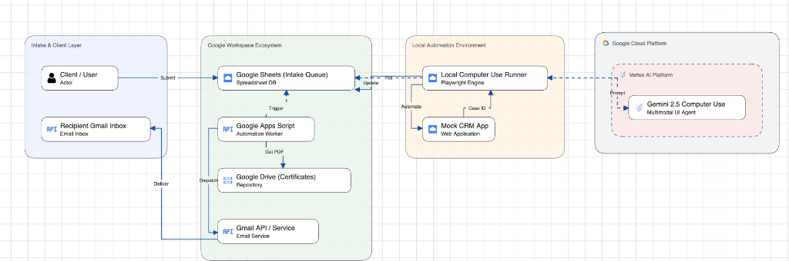

# 🚀 Tax Certificate Computer Use Automation (Gemini 2.5)

An end-to-end autonomous agent system powered by **Gemini 2.5 Computer Use (`gemini-2.5-computer-use-preview-10-2025`)**, **Playwright**, **Google Sheets**, and **Google Apps Script**.

The system automatically monitors an intake queue in Google Sheets, launches a visible local Chrome browser on your desktop, visually navigates a CRM web application to create tax certificate cases, writes the generated Case IDs directly back to Google Sheets, and dispatches confirmation emails with PDF attachments to clients.

---

## 📌 Executive Summary

Modern enterprise operations often rely on legacy CRM web portals that lack REST APIs. This solution demonstrates how **Google Cloud Vertex AI Gemini 2.5 Computer Use** acts as a human-like digital worker:
- **Vision-Based Navigation**: Evaluates screenshot UI coordinates dynamically without relying on fixed CSS selectors.
- **Zero Cloud Sandbox Required**: Operates 100% locally on your Mac desktop inside a visible Playwright Chrome browser window.
- **Bi-Directional Google Sheets Sync**: Fetches pending requests (`READY_FOR_CRM`), processes them with `row_index` precision, and updates completion status (`COMPLETED`) and `Case_ID`.
- **Automated Document Dispatch**: Google Apps Script monitors state changes, fetches official tax certificate PDFs from Google Drive, and emails clients automatically from `admin@mashsyed.demo.altostrat.com`.

---

## 🏗️ System Architecture & End-to-End Workflow



```text
[1. Client Intake Layer]         [2. Event & Doc Engine]            [3. Computer Use Layer]            [4. Target CRM]
   Google Form Submits  ───►  Google Apps Script Backend  ◄───►  local_runner.py (Playwright)  ───►  TP Client CRM Portal
   Appends to Sheet           - Generates PDF in Drive           - Gemini 2.5 Vision Loop            (localhost:8080)
                              - Status: READY_FOR_CRM            - Clicks, Types & Solves UI         - Generates Case ID
                              - Auto-Dispatches Email            - Updates row_index directly
```

---

## 🛠️ Requirements & Prerequisites

### 1. System Requirements
- **OS**: macOS, Linux, or Windows
- **Python**: Python 3.10+ (Python 3.13 recommended)
- **Google Cloud SDK (`gcloud`)**: Installed and configured

### 2. Python Dependencies
All required libraries are listed in `requirements.txt`:
- `google-genai` (Vertex AI Gemini 2.5 SDK)
- `playwright` (Browser automation)
- `gspread` (Google Sheets Python API)
- `google-auth` / `google-auth-oauthlib`
- `python-dotenv`

### 3. Google Cloud Project Access
- **GCP Project**: Vertex AI API enabled (`aiplatform.googleapis.com`)
- **Model**: `gemini-2.5-computer-use-preview-10-2025`
- **GCP Region/Location**: `global` or `us-central1`

---

## 🚀 Quick Start Guide

### Step 1: Clone Repository & Install Dependencies

```bash
git clone https://github.com/mashsyed/ge-computer-use-poc-tp.git
cd ge-computer-use-poc-tp

# Install Python requirements
pip install -r requirements.txt

# Install Playwright Chromium browser
playwright install chromium
```

---

### Step 2: Configure Environment Variables

Create or update the `.env` file in the project root:

```ini
GOOGLE_CLOUD_PROJECT=cs-poc-xbm3l5p9n29nrv0hx1ynd7s
GOOGLE_LOCATION=global
MODEL_ID=gemini-2.5-computer-use-preview-10-2025
SPREADSHEET_ID=157OgVttSnTcWooXUVF6w-HWSDw0K9WuxLzEw5L0K_jc
LOCAL_CRM_URL=http://localhost:8080
APPS_SCRIPT_WEBAPP_URL=https://script.google.com/macros/s/AKfycbz2bjGc9wLkmVIo7RapoGQy6npOefM-NJk2vzbaOvV1vUanlwCPgBAIYmZRH0Djp5s_FQ/exec
```

---

### Step 3: Authenticate Application Default Credentials (ADC)

Grant Google Cloud permissions to ADC:

```bash
gcloud auth application-default login --scopes="https://www.googleapis.com/auth/cloud-platform,https://www.googleapis.com/auth/spreadsheets,https://www.googleapis.com/auth/drive"
```

---

### Step 4: Start the Local CRM Application

In a separate terminal window, launch the multi-threaded mock CRM web server:

```bash
python3 mock_crm_server.py 8080
```

Verify the server is running by opening `http://localhost:8080/login` in your browser.

---

### Step 5: Execute the Local Computer Use Runner

In your main terminal, run:

```bash
python3 local_runner.py
```

Watch the agent launch Chrome, log into the CRM, search the client record, submit the case, extract the generated `Case_ID`, update Google Sheets, and trigger email dispatch automatically!

---

## 📂 Codebase & File Structure

```text
ge-computer-use-poc-tp/
├── local_runner.py         # Main Playwright + Gemini 2.5 Computer Use runner
├── mock_crm_server.py      # Multi-threaded Mock CRM server (Port 8080)
├── Code.gs                 # Google Apps Script for automated PDF email dispatch
├── architecture_diagram.png # System Architecture Diagram
├── architecture_diagram.md  # Detailed Architecture & Sequence Specification
├── .env                    # Environment configuration
├── .gitignore              # Excludes credentials and temp files
├── requirements.txt        # Python package dependencies
└── README.md               # Architecture documentation & guide
```

---

## 📄 License

Copyright 2026 Google LLC. Licensed under the Apache License, Version 2.0.
